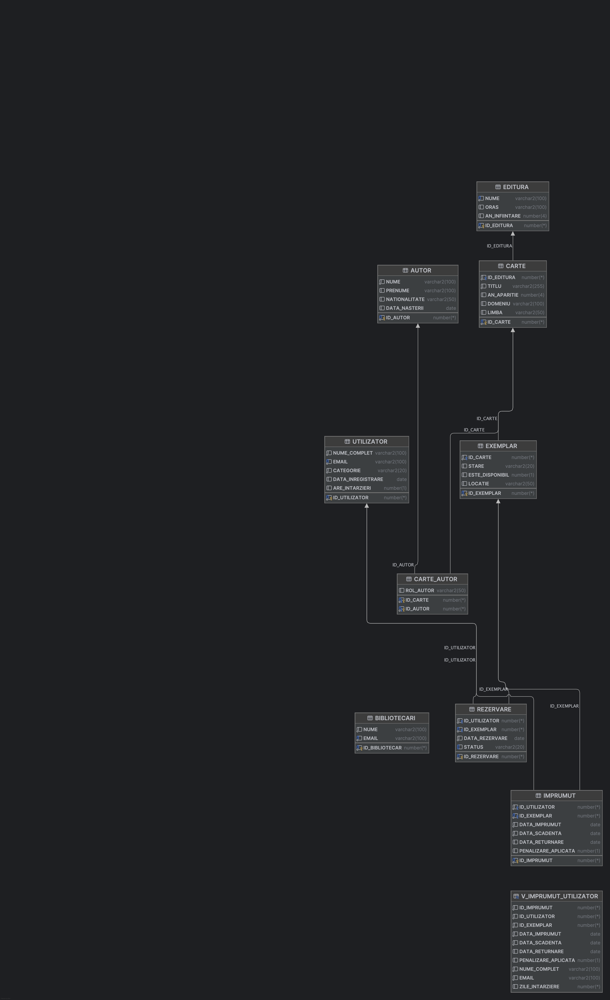

# Sistem de Gestiune a unei Biblioteci Universitare

Acest proiect reprezintă o soluție completă de baze de date pentru administrarea fluxurilor de lucru dintr-o bibliotecă. Proiectul acoperă întreg ciclul de dezvoltare, de la modelarea conceptuală și normalizare, până la implementarea fizică în Oracle SQL și execuția de interogări complexe.

## Tehnologii Utilizate
* **SGBD:** Oracle Database
* **IDE:** JetBrains DataGrip / Oracle SQL Developer
* **Limbaj:** SQL (DDL, DML, DQL)
* **Modelare:** Diagramă Entitate-Relație (ERD)

## Arhitectura Bazei de Date
Sistemul este compus din **8 tabele** principale, structurate pentru a elimina redundanța prin procesul de **normalizare (FN1, FN2, FN3)**:
* `UTILIZATOR` - Membrii bibliotecii (studenți, profesori).
* `CARTE` & `EDITURA` - Catalogul de resurse.
* `EXEMPLAR` - Gestionarea stocului fizic.
* `IMPRUMUT` - Tabelul central pentru tranzacții.
* `PENALIZARE` & `REZERVARE` - Managementul fluxurilor secundare.

### Diagrama ERD
 

## Funcționalități și Cereri SQL Complexe
Proiectul include scripturi pentru:
1.  **Gestiunea împrumuturilor:** Calcularea automată a datei de returnare și a penalizărilor.
2.  **Interogări Avansate:**
    * Utilizarea **subcererilor sincronizate** și a clauzei `WITH`.
    * Operații de tip **Division** (ex: găsirea utilizatorilor care au citit toate cărțile unei anumite edituri).
    * Analiză **Top-N** (ex: cele mai populare 3 titluri împrumutate).
    * Funcții analitice și grupări complexe (`GROUP BY`, `HAVING`).

## 📋 Reguli de Business Implementate
* Un utilizator poate avea maxim 5 împrumuturi active.
* Termenul de împrumut diferă în funcție de tipul utilizatorului (Student vs. Profesor).
* Sistemul blochează automat împrumuturile noi dacă există penalizări neachitate.
